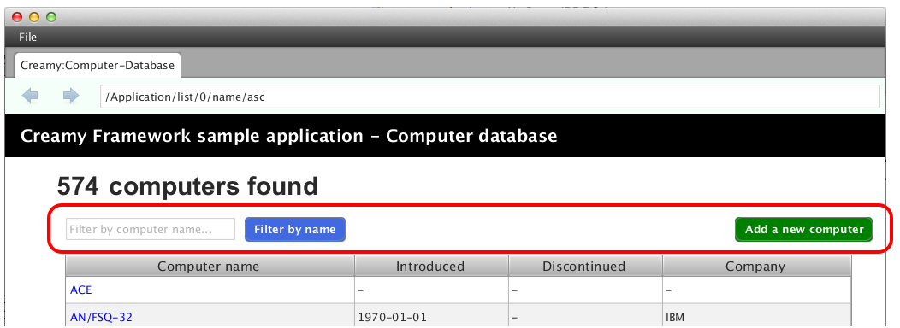

=============================================
Formコントロール
=============================================
Formコントロールは、JavaFXが提供するUIコントロールを拡張したものです。

クラス名は、JavaFX UIコントロール名に 'CF' 接頭辞を付けたものです。

**CFButton**

Buttonクラスを拡張したコントロールです。name変数を保持します。

.. code-block:: java

 public class CFButton extends Button
  
**CFChoiceBox**

ChoiceBoxクラスを拡張したコントロールです。name変数、value変数、map変数を保持します。FromInputは、name変数、value変数のgetter、setterメソッドを定義するインターフェースです。

.. code-block:: java

 public class CFChoiceBox<T> extends ChoiceBox<T> implements FormInput
 
**CFHyperlink**

Hyperlinkクラスを拡張したコントロールです。method変数、path変数を保持します。method変数にはデータ送信メソッドのGET/POSTを設定し、path変数には、次の画面遷移先のパスを設定します。UnitRequestインターフェースを実装しています。UnitRequestはmethod変数、path変数を取得するメソッドが定義されています。

.. code-block:: java

 public class CFHyperlink extends Hyperlink implements UnitRequest

**CFLabel**

Labelクラスを拡張したコントロールです。name変数、value変数を保持します。FromInputインターフェースを実装していますので、これらの変数値に値を設定・取得できます。

.. code-block:: java

 public class CFLabel extends Label implements FormInput
 
**CFLinkButton**

Buttonクラスを拡張したコントロールです。method変数、path変数を保持します。method変数にはデータ送信メソッドのGET/POSTを設定し、path変数には、次の画面遷移先のパスを設定します。UnitRequestインターフェースを実装しています。UnitRequestはmethod変数、path変数を取得するメソッドが定義されています。

.. code-block:: java

 public class CFLinkButton extends Button implements UnitRequest
 
**CFListView**

ListViewクラスを拡張したコントロールです。name変数、value変数、map変数を保持します。FromInputインターフェースを実装していますので、これらの変数値に値を設定・取得できます。

.. code-block:: java

 public class CFListView<T> extends ListView<T> implements FormInput
 
**CFSubmitButton**

Buttonクラスを拡張したコントロールです。FormRequestインターフェースを実装しています。FormRequestは何のメソッドも定義していませんが、次画面にリクエストを送るコントロールです。

.. code-block:: java

 public class CFSubmitButton extends Button implements FormRequest

**CFTextField**

TextFieldクラスを拡張したコントロールです。name変数、value変数を保持します。FromInputインターフェースを実装していますので、これらの変数値に値を設定・取得できます。

.. code-block:: java

 public class CFTextField extends TextField implements FormInput
 
 

以下に挙げるクラスは、JavaFXのレイアウトクラスを拡張したCreamy Layout Paneです。HTMLのformタグにあたるもので、画面遷移先のURLを表すpath変数と、データ送信方法のmethod変数を保持します。

**CFGridForm**

GridPaneクラスを拡張したLayout Paneです。

.. code-block:: java

 public class CFGridForm extends GridPane implements Form

**CFHForm**

HBoxクラスを拡張したLayout Paneです。

.. code-block:: java

 public class CFHForm extends HBox implements Form
 
**CFVForm**

VBoxクラスを拡張したLayout Paneです。

.. code-block:: java

 public class CFVForm extends VBox implements Form
 
これらのFormコントロールは、2通りの方法で記述することができます。

１つはActivityクラスが提供するメソッドを使って記述する方法です。詳しくは `継承すべきクラスが提供する機能 <views.html#id3>`_ を参照して下さい。

もう１つは、以下に説明するFXMLファイルに記述する方法です。

提供する機能
=============================================
HTMLファイルのformタグ内にinput要素などを記述しておけば、サーバ側でそのinput要素のname属性からvalue値を取得することができます。
Formコントロールもこの考え方に倣い、name、valueメンバ変数を保持しています。

例えば、CFSubmitButtonがクリックされたとき、CFHFormに配置されたCFTextFieldのvalue値を、name値をキーに取得できます。画面遷移があるアプリケーションの場合は、そのvalue値が次の画面に自動的にバインドされます。

記述方法
=============================================
Formコントロールは、FXMLファイルにタグとして記述することができます。

**画面例**

次の画面は、Formコントロールを使って記述しています。

**記述例① - List.vm.fxml**

次は、上記画面の赤枠内を記述した例です。<CFHForm>の<childre>として、<CFTextField>と<CFSubmitButton>を配置しています。

.. code-block:: html
    :linenos:
    
    <CFHForm fx:id="searchForm" method="GET" spacing="10.0" alignment="CENTER_LEFT" >
      <children>
        <CFTextField fx:id="filter" name="filter" promptText="Filter by computer name..." prefWidth="200.0"/>
        <CFSubmitButton fx:id="filterButton" styleClass="btn-primary" text="Filter by name" />
      </children>
    </CFHForm>

**記述例② - List.vm.fxml**

次は、<CFLinkButton>の記述例です。Add a new computerリンクボタンを配置しています。

.. code-block:: html
    :linenos:
    
    <CFLinkButton fx:id="createButton" styleClass="btn-success"  
      path="/Application/create" alignment="CENTER_RIGHT"  text="Add a new computer" />

**記述例③ - List.java**

上のFXMLに対応する記述部分は以下の通りです。12行目で、searchFormの遷移先のパスを設定しています。画面のFilter by nameボタン（CFSubmitButton）をクリックすると、Applicationクラスのlistメソッドを呼び出します。このとき、<CFTextField>の設定値が渡されます。

.. code-block:: java
  :linenos:

  public class List extends AvailableActivity {
    @FXML private CFHForm searchForm;
    @FXML private CFTextField filter;
    @FXML private CFLinkButton createButton;
        :
    public void initialize() {
      path = Bindings.concat("/Application/list/", currentPage, "/", sortBy, "/", order);
      // build search form
      searchForm.addEventFilter(ActionEvent.ACTION, new EventHandler<ActionEvent>() {
          @Override
          public void handle(ActionEvent event) {
              searchForm.setPath(path.getValue());
          }
      });
    }
  }

**記述例④ - Aplication.java**

次は、上の例のApplicationコントローラクラスの実装例です。

.. code-block:: java
  :linenos:

  public class Application extends Controller {
    private Page<Computer> listComputer;
    private Computer computer;
    private StringProperty order = new SimpleStringProperty();
    private StringProperty sortBy = new SimpleStringProperty();
    private StringProperty query = new SimpleStringProperty();

    //GET Aplication/list/:page/:sortBy/:order
    public Result list(int page, String sortBy, String order, @Bind(key="filter") String filter) {
        //this.currentPage.set(String.valueOf(page));
        this.sortBy.set(sortBy);
        this.order.set(order);
        this.query.set(filter == null ? "" : filter);
        listComputer = Computer.page(page, 10, sortBy, order, query.get());
        return ok(this);
    }
    //GET Aplication/create
    public Result create() {
        computer = new Computer();
        return ok(this);
    }
  }

9行目のlistメソッドは、Filter by nameボタンがクリックされたときに呼ばれるメソッドで、記述例③でsearchFormに設定された変数値path="/Application/list/" に対応します。

18行目のcreateメソッドは、Add a new computerリンクがクリックされたときに呼ばれるメソッドで、記述例②で<CFLinkButton>に設定された属性値path="/Application/create" に対応します。
