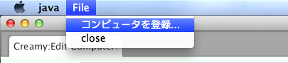

=============================================
小画面の作成
=============================================
デスクトップアプリケーションには少なくとも１つのウィンドウがありますが、多くの場合、機能を補う小画面を持っています。パッケージのインストーラのウィザード画面のように、その画面内でページ遷移が行われるものや、エラーメッセージを表示するだけの警告ダイアログなど、いくつか種類があります。ここでは、それら小画面を作成する方法を説明します。

提供する機能
=============================================
Creamyで画面を作成する場合Creamy Browserを使います。小画面も同様です。アプリケーションのベースになる画面（親画面）にボタンやメニューを配置し、そのアクションとして小画面を生成します。

******** もっと書く！！********

記述方法
=============================================
Creamyは、小画面を生成するためのメソッドを提供します。小画面と親画面とのActivityとしての関連を設定したり、ウィンドウの親子関係を設定するなどの細かな処理を隠蔽します。

次の例は、アプリケーションメニューに小画面作成のサブメニューを追加したものです。

**記述例１**

.. code-block:: java
        :linenos:

        // メニューからダイアログを表示する
        MenuItem item = new MenuItem("コンピュータを登録...");
        item.setOnAction(new EventHandler<ActionEvent>() {
            @Override
            public void handle(ActionEvent t) {
                // 新規ダイアログを生成
                Activity dialog = Activity.createDialog(
                        browser, "/DialogController/create", Modality.APPLICATION_MODAL);
            }
        });
        // 'コンピュータを登録...' メニューを追加
        menubar.getMenus().get(0).getItems().add(0, item);
        primaryStage.show();   

2行目で新しいMenuItemを作成し、そのアクションとしてEventHanderを生成しています。

7、8行目で小画面生成しています。Activity.createメソッドの第１引数は、親browserのインスタンスを渡します。第2引数が小画面のパスです。コントローラクラスがDialogController、初期画面はCreate.java、Create.vm.fxmlファイルで構成されています。第3引数のModality.APPLICATION_MODALは、小画面がクローズするまで親画面を操作させない設定です。

**実行例１**

メニューから次の小画面を表示します。

上の例では、Modality.APPLICATION_MODALを指定しましたので、小画面をクローズするまで親画面とデータのやり取りをする必要がありませんでした。しかし、どちらも操作可能な状態でデータをやり取りし、再描画させる場合もあります。

次の例は、検索ダイアログを生成する例です。検索実行後、検索結果を親画面に反映させています。

親画面のSearchComputerボタンをクリックすると、検索ダイアログを表示します。検索条件を入力してSearchボタンをクリックすると、検索結果を親画面に表示します。

**実行例２**

.. image:: SearchDialog.png
    :width: 500px

**記述例２**

.. code-block:: java
    :linenos:

    @FXML private void search(ActionEvent event) {
        // 検索ダイアログを表示して、Searchなら続行、Cancelなら中断
        Activity dialog = createDialog("/TestEditableController/search", Modality.NONE);
    }

1行目は、Search Computerボタンのアクションメソッドです。

3行目で検索ダイアログを生成しています。第2引数でModality.NONEを指定していますので、検索ダイアログを表示している間も、親画面の操作ができます。

記述例１では、メニューから小画面を作成していましたので、親画面にあたるBrowserのインスタンスを指定しなければいけませんでしがが、記述例２では親画面にボタンが配置されているので、インスタンスを指定する必要がありません。