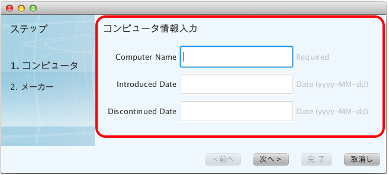
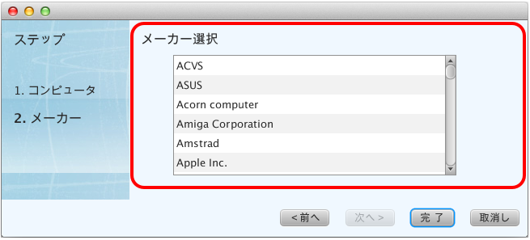

=============================================
部分テンプレート (renderマクロ)
=============================================
レイアウトテンプレートは、共通する領域に画面ごとの固有の領域を書き換えて表示する仕組みですが、再描画の単位としてはは画面全体が対象でした。しかし、画面によっては画面全体を再描画するのでは効率の悪い場合があります。

部分テンプレートは、renderマクロを使って再描画したい領域だけを書き換えることができます。

提供する機能
=============================================
FXMLファイルにVelocity構文の renderマクロを記述することで、部分的な再描画が可能になります。

画面「全体」と、再描画する「部分」との関係は、Activityクラスの親子関係で実現しています。子Activityの変更が親Activityに影響を与える場合、またはその逆の場合を考慮して、相互の参照を取得できます。

**画面例**

次の画面の赤枠内が、NewComputer.javaとNewComputer.vm.fxmlで構成する部分領域で、その外側が、NewDialog.javaとNewDialog.vm.fxmlで構成する共通領域です。

「次へ」ボタンをクリックすると、部分領域がSelectCompany.javaとSelectCompany.vm.fxmlで構成する部分領域に置き変わります。

部分領域が置き換わったとき、全体領域にあるステップの表示フォント、各ボタンの選択可・不可の設定が変わります。つまり、部分領域の変更が、全体領域に影響を受けていることになります。

記述方法
=============================================
まず、共通部分であるNewDialog.vm.fxmlファイルの記述から見ていきます。`Creamy独自の記述方法の説明 <views.html#creamy>`_  でも説明したように、共通部分を以下のように記述しています。

**実装例 - NewDialog.vm.fxml**

.. code-block:: html
 :linenos:
 
  <ChildPane fx:id="inputArea" prefHeight="196.0" prefWidth="463.0">
   <children>
     <!--% #render("NewComputer") -->
   </children>
 </ChildPane>

3行目の #renderマクロで、この位置にNewComputerアクティビティを配置します。

次の記述は、画面左側の「ステップ」の領域です。

.. code-block:: java
 :linenos:
 
 <VBox disable="false" prefHeight="222.0" prefWidth="158.0" spacing="0.0" styleClass="step-pane">
  <children>
    <Label text="ステップ">
      
        
      
    </Label>
    <GridPane prefHeight="177.0" prefWidth="100.0">
      <children>
        <Label fx:id="step1Label" styleClass="label-current" text="1. コンピュータ" GridPane.columnIndex="0" GridPane.rowIndex="1">
          <stylesheets>
            <URL value="@NewDialog.css" />
          </stylesheets>
        </Label>
        <Label fx:id="step2Label" styleClass="label-past" text="2. メーカー" GridPane.columnIndex="0" GridPane.rowIndex="2">
          <stylesheets>
            <URL value="@NewDialog.css" />
          </stylesheets>
        </Label>
      </children>
              :
              :
    </GridPane>
  </children>
 </VBox>

10〜14行目で「1. コンピュータ」、15〜19行目で「2. メーカー」を設定しています。それぞれ fx:id属性を設定していますので、画面遷移によってLabelのスタイルクラスを変更することができます。

次は、画面下の「ボタン」領域の記述です。

.. code-block:: java
 :linenos:
 
 <HBox alignment="CENTER_RIGHT" prefHeight="44.0" prefWidth="561.0">
  <children>
    <Button fx:id="prevButton" mnemonicParsing="false" onAction="#handlePrevAction" text="＜前へ">
      <HBox.margin>
        <Insets right="10.0" />
      </HBox.margin>
    </Button>
    <Button fx:id="nextButton" mnemonicParsing="false" onAction="#handleNextAction" text="次へ＞">
      <HBox.margin>
        <Insets left="10.0" right="10.0" fx:id="x1" />
      </HBox.margin>
    </Button>
    <Button fx:id="finishButton" mnemonicParsing="false" onAction="#handleCreateAction" text="完 了" HBox.margin="$x1" />
    <Button mnemonicParsing="false" onAction="#handleCancelAction" text="取消し" HBox.margin="$x1" />
  </children>
  <VBox.margin>
    <Insets />
  </VBox.margin>
 </HBox>

3〜7行目が「＜前へ」、8〜12行目が「次へ＞」、13行目に「完了」、14行目が「取消し」ボタンです。これらも、画面遷移によって選択可・不可を切り替えますので、 fx:id属性を設定しています。

また、すべてのButtonにonAction属性を設定しています。これは、ボタンがクリックされたときのアクションメソッド名を設定したもので、NewDialogクラスに実装しています。

8行目の「次へ＞」ボタンアクションの実装は、NewDialogクラスにあります。

**実装例 - NewDialog.java**

.. code-block:: java
 :linenos:
 
 @FXML private void handleNextAction(ActionEvent event) {
    // NewComputerアクティビティを保持
    computer = (NewComputer) this.getChildActivities(NewComputer.class).get(0);

    // 次に遷移するパス
    String path = "/NewDialogController/selectCompany";

    requestActivity(path)
            .onSuccess(new CallBack<Activity>() {
                @Override
                public void call(Activity activity, Status status) {
                    // 検索結果を反映したアクティビティに置き換える。
                    inputArea.getChildren().clear();
                    inputArea.getChildren().add(activity.getScene());

                    // SelectComputerアクティビティを保持
                    company = (SelectCompany) activity;
                }
            })
            .execute();
 }

3行目で、ステップ１画面のNewComputerアクティビティを取得して、NewDialogアクティビティが保持します。

6行目は次に遷移する画面のパスです。SelectCompanyは、メーカ名を選択する画面です。

8行目のrequestActivityメソッドで、次の画面へ遷移します。SelectCompanyアクティビティの取得に成功したら（9行目）、callメソッドを実行します（11行目）。

13、14行目のinputAreaは、**実装例 - NewDialog.vm.fxml** のChildPane要素のfx:id属性値で、画面例の赤枠内のfx:idです。
中身をクリア（13行目）して、引数で渡されたactivity（ここでは、SelectCompanyアクティビティ）に置き換えます（14行目）。

17行目で、新たに生成された（ステップ２画面の）SelectCompanyアクティビティを保持します。

画面遷移によって共通部分のLabelやButtonの設定を変えているのが、次の記述です。

**実装例２ - NewDialog.java**

.. code-block:: java
 :linenos:
 
 @Override
 public void initialize() {
    // ラベル、ボタンの初期状態を設定
    step1Label.getStyleClass().add("label-current");
    step2Label.getStyleClass().add("label-past");
    prevButton.setDisable(true);
    finishButton.setDisable(true);

    // 前へボタンのイベントハンドラをセット
    prevButton.addEventHandler(ActionEvent.ACTION, new EventHandler<ActionEvent>() {
        @Override
        public void handle(ActionEvent t) {
            // ステップ１ラベルを太字に変更
            step1Label.getStyleClass().clear();
            step1Label.getStyleClass().add("label-current");
            step2Label.getStyleClass().clear();
            step2Label.getStyleClass().add("label-past");
            // 次へボタンを選択可に変更
            prevButton.setDisable(true);
            nextButton.setDisable(false);
            finishButton.setDisable(true);
        }
    });
    // 次へボタンのイベントハンドラをセット
    nextButton.addEventHandler(ActionEvent.ACTION, new EventHandler<ActionEvent>() {
        @Override
        public void handle(ActionEvent t) {
            // ステップ２ラベルを太字に変更
            step1Label.getStyleClass().clear();
            step1Label.getStyleClass().add("label-past");
            step2Label.getStyleClass().clear();
            step2Label.getStyleClass().add("label-current");
            // 前へ、完了ボタンを選択可に変更
            prevButton.setDisable(false);
            nextButton.setDisable(true);
            finishButton.setDisable(false);
        }
    });
 }

4〜7行目が初期状態の設定です。

10〜23行目で「＜前へ」ボタンのイベントハンドラをセットしています。「＜前へ」ボタンがクリックされると、「ステップ１」Labelのフォントを太字に変え、「次へ＞」ボタンを選択可能に変えます。

25〜38行目で「次へ＞」ボタンのイベントハンドラをセットしています。「次へ＞」ボタンがクリックされると、「ステップ２」Labelのフォントを太字に変え、「＜前へ」ボタンを選択可能に変えます。