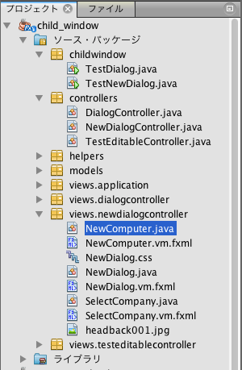

=============================================
Views
=============================================

viewsパッケージに置くべきファイル
=============================================
viewsパッケージは、MVCアーキテクチャのViewにあたるもので、画面表示に関わる次のファイルを配置します。

* javaファイル
* fxmlファイル
* cssファイル
* イメージファイル

fxmlファイルのcontrollerクラスとしてjavaファイルを作成します。スタイルシートを適用する場合は、同じファイル名でcssファイルを配置します。

これらのファイルは、viewsパッケージ配下に、Creamyコントローラクラス名をすべて小文字に変換した名前でパッケージを作成し、さらにその配下に配置します。

クラス名と同じ名前でcssファイルを配備しておけば、スタイルシートの適用処理を記述しなくても自動的に適用されます。

次の例は、新しいコンピュータデータを登録するCreamyアプリケーションのパッケージ構成です。

起動プログラムはchildwindow.TestNewDialogクラスで、Creamyコントローラクラスがcontrollers.NewDialogControllerです。

viewsクラスがviews.newdialogcontrollerパッケージに配置されています。

**パッケージ構成例**

NewComputer.javaとNewComputer.vm.fxmlでコンピュータデータの登録画面を構成しています。

SelectCompany.javaとSelectCompany.vm.fmlで、メーカー名の選択画面を構成しています。

**画面例**

初期画面では、NewDialog.javaとNewDialog.vm.fxmlで構成するベースの画面に、NewComputer画面を貼付けた形で表示されます。

「次へ」ボタンをクリックすると、SelectCompany画面に遷移します。

.. image:: SelectCompany.png
    :width: 500px

１つのCreamyアプリケーションには、１つ以上のコントローラクラスを作成することができます。その場合は、それぞれのコントローラクラスに対応するviews.<Creamyコントローラクラス名>パッケージを作成します。

継承すべきクラス
=============================================
ここでは、viewsパッケージ以下に配置するjavaクラスを総称して、viewsクラスと呼びます。
viewsクラスは、AvailableActivityクラスを継承して作成します。

**AvailableActivityクラス**

.. code-block:: java

  public class AvailableActivity extends Activity implements Available {
    @Override
    public void initialize() {}
	:
  }

**記述例**

以下のコードは、AvailableActivityを継承してNewComputerクラスを定義した例です。
新しいコンピュータデータを登録する画面に対応するクラスです。

.. code-block:: java

 public class NewComputer extends AvailableActivity {
    
    @FXML private TextField name;
    @FXML private TextField intoroduced;
    @FXML private TextField discontinued;
    
    /**
     * @return コンピュータ名 String
     */
    protected String getName() {
        return name.getText();
    }
    /**
     * @return 発表日 String
     */
    protected String getIntoroduced() {
        return intoroduced.getText();
    }
    /**
     * @return 製造中止日 String
     */
    protected String getDiscontinued() {
        return discontinued.getText();
    }
 }

継承すべきクラスが提供する機能
=============================================
AvailableActivityクラスは、画面表示に必要なCreamy UIコントロールの描画メソッドを提供します。

各Creamy UIコントロールの詳細については、`Formコントロール <form_control.html>`_ を参照して下さい。

CFGridFormの生成
******************

.. code-block:: java

    public CFGridForm gridForm(String path)

CFGridFormを生成します。pathには、画面遷移先のパスを指定します。

**記述例**

次の例では、Applicationコントローラクラスのsaveメソッドを実行するpathを指定してCFGridFormを生成しています。データ送信メソッドはPOST、スタイルクラスとしてgird-formを適用しています。

.. code-block:: java

  createForm.getChildren().add(
    gridForm("/Application/save").method(Request.POST).styleClass("grid-form")
 	:

CFHFormの生成
******************

.. code-block:: java

    public CFHForm hform(String path)

CFHFormを生成します。pathには、画面遷移先のパスを指定します。

**記述例**

次の例では、Applicationコントローラクラスのdeleteメソッドを実行するpathを指定してCFHFormを生成しています。データ送信メソッドはPOST、CFHFrom内のAlignmentにPos.CENTER_RIGHT（縦方向中央寄せ、横方向右寄せ）を指定しています。

.. code-block:: java

  deleteForm.getChildren().add(
    hform("/Application/delete/" + computer.getId()).method(Request.POST).align(Pos.CENTER_RIGHT)
 	:

CFVFormの生成
******************

.. code-block:: java

    public CFVForm vform(String path)

CFVFormを生成します。pathには、画面遷移先のパスを指定します。

**記述例**

CFLabelの生成
******************

.. code-block:: java

    public LabelBuilder<? extends LabelBuilder> label(String text)

CFLabelを生成します。textには、表示文字列を指定します。

**記述例**

CFTextFieldの生成
******************

.. code-block:: java

    public CFTextFieldBuilder<? extends CFTextFieldBuilder> text(String name)

CFTextFieldを生成します。nameには、name属性値にあたる文字列を指定します。 

**記述例**

CFChoiceBoxの生成
******************

.. code-block:: java

    public CFChoiceBoxBuilder<?, ? extends CFChoiceBoxBuilder> choice(String name)

CFChoiceBoxを生成します。nameには、name属性値にあたる文字列を指定します。

**記述例**

CFButtonの生成
******************

.. code-block:: java

    public CFButtonBuilder<? extends CFButtonBuilder> button(String name)

CFButtonを生成します。nameには、name属性値にあたる文字列を指定します。

**記述例**

CFHyperlinkの生成
******************

.. code-block:: java

    public CFHyperlinkBuilder<? extends CFHyperlinkBuilder> hyperlink(String path)

CFHyperlinkを生成します。pathには、画面遷移先のパスを指定します。

**記述例**

CFLinkButtonの生成
******************

.. code-block:: java

    public CFLinkButtonBuilder<? extends CFLinkButtonBuilder> linkbutton(String path)

CFLinkButtonを生成します。pathには、画面遷移先のパスを指定します。

**記述例**

CFSubmitButtonの生成
******************

.. code-block:: java

    public CFSubmitButtonBuilder<? extends CFSubmitButtonBuilder> submit(String text)

CFSubmitButtonを生成します。pathには、画面遷移先のパスを指定します。

**記述例**

CFAnimationの生成
******************

.. code-block:: java

    protected CFAnimation animate(Node node)

CFAnimationを生成します。nodeには、animation機能を追加するノードを指定します。

**記述例**

Activity記述例
*********************
次の例は、コンピュータデータ登録画面をAvailableActivityが提供するメソッドを使って作成しています。
画面描画内容は、Activityクラスのinitialize()メソッドで実装します。

**記述例 - Create.java**

.. code-block:: java
 
 @Override
 public void initialize() {
  createForm.getChildren().add(
    gridForm("/Application/save").method(Request.POST).styleClass("grid-form")
      .row(label("Computer Name:"),
           text("name"),
           label("Required").styleClass(this.validationResult.hasError() ? "err-text" : "guide-text"))
      .row(label("Introduced Date :"),
           text("introduced").format(format),
           label("Date (" + DATE_FORMAT + ")").styleClass("guide-text"))
      .row(label("Discontinued Date :"),
           text("discontinued").format(format),
           label("Date (" + DATE_FORMAT + ")").styleClass("guide-text")    )
      .row(label("Company :"),
           choice("company.id").items(Company.options()).prefWidth(275))
      .row(hbox(submit("Create this computer").styleClass("btn-primary"),
                label(" or "),
                linkbutton("/Application/index").text("Cancel").styleClass("btn"))
          .padding(new Insets(15,0,15,140)).spacing(5)
          .styleClass("actions")
          ,3)
  );
 }

FXMLの書き方（簡単なもの）
=============================================
上記のCreate.javaに実装した内容を表示するには、Create.vm.fxmlファイルが必要です。
ここでは、Creamyアプリケーションを作成するために必要なFXMLの記述方法を説明します。

より詳細なFXMLの記述方法は、以下を参照してください。

`http://docs.oracle.com/javafx/2/api/javafx/fxml/doc-files/introduction_to_fxml.html <http://docs.oracle.com/javafx/2/api/javafx/fxml/doc-files/introduction_to_fxml.html#overview>`_ 

まず、<AnchorPane>要素のfx:controller属性にコントローラクラス名を指定して、FXMLファイルとクラスファイルを関連づけます。以下の例では、fx:controller="views.application.Create" の部分がそれにあたります。

**記述例 - Create.vm.fxml**

.. code-block:: html
 
 <AnchorPane id="AnchorPane" maxHeight="-Infinity" maxWidth="-Infinity" 
    minHeight="-Infinity" minWidth="-Infinity" 
    prefHeight="600.0" prefWidth="1000.0" 
    xmlns:fx="http://javafx.com/fxml" 
    fx:controller="views.application.Create">

次に、views.application.Createクラスのinitialize()メソッドで実装した内容を、FXMLファイルのどこに配置するかを決めます。

ここでは、<StackPane>の<children>要素として加えることにしましたので、views.application.Createクラスからその位置がわかるように、fx:id属性として名前を指定します。

次の例では、fx:id="createForm" として、<StackPane>のidを設定しています。

**記述例 - Create.vm.fxml**

.. code-block:: html
 
  <StackPane id="stackPane1" fx:id="createForm" alignment="TOP_LEFT" 
          prefHeight="484.0" prefWidth="760.0" 
          AnchorPane.bottomAnchor="0.0" AnchorPane.leftAnchor="0.0" 
          AnchorPane.rightAnchor="0.0" AnchorPane.topAnchor="0.0">
    <children>
        :
    </children>
  </StackPane>

views.application.Createクラスでは、fx:idの属性値として指定した"createForm"をインスタンス変数名として宣言します。その際、@FXMLアノテーションを付けおくことで<StackPane>と関連づけられます。

**記述例 - Create.java**

.. code-block:: java
 
 public class Create extends AvailableActivity {
    @FXML private StackPane createForm;
        :

以下は、コンピュータデータ登録画面の実行例です。

**実行例**

.. image:: AddComputer.png

起動プログラムはcomputerdatabase.ComputerDatabaseクラスで、Creamyコントローラクラスがcontrollers.Applicationです。

viewsクラスがviews.applicationパッケージに配置されています。

**パッケージ構成例**

Creamy独自の記述方法の説明
=============================================
